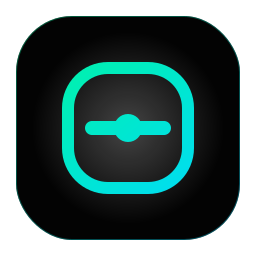

# CipherNet

<p align="center">
	
</p>

<p align="center">
	<strong>The Privacy Layer for Digital Credential Verification.</strong>
</p>

<p align="center">
	CipherNet is a privacy-preserving credential verification platform built on Midnight. Users prove ownership and authenticity without revealing sensitive documents.
</p>

## Overview

CipherNet is a Level 1 New Moon submission for Midnight Moonshots. It demonstrates a production-minded foundation for confidential credential verification using Midnight Compact, a private witness model, managed artifacts, a deployable frontend, and a proof-oriented backend.

Instead of exposing identity cards, passports, certificates, medical records, or financial statements, CipherNet lets users prove the relevant facts and keep the underlying document private.

## Product Idea

CipherNet is a privacy-preserving decentralized credential verification platform built on Midnight. Instead of sharing sensitive documents such as identity cards, certificates, financial records, or medical reports, users prove specific facts using confidential smart contracts. Organizations verify authenticity without accessing the underlying documents, giving users complete ownership and privacy over their credentials.

## Features

- Confidential credentials with minimum disclosure
- Private witness handling for sensitive proof material
- Midnight Compact contract for public and private state separation
- Hash-based verification for deterministic integrity checks
- Express proof server for local development and preview workflows
- Premium landing page built with Next.js 15, React 19, TailwindCSS, Framer Motion, and Lucide icons

## Architecture

- Frontend: Next.js 15 app router with motion-driven landing page and SEO metadata
- Backend: Express proof server for health checks and credential hashing
- Blockchain: Midnight Compact contract with public ledger state and private witness data
- Testing: Vitest suite for credential hashing, witness derivation, and contract structure checks
- Managed: Generated artifact manifest and source hash stored in `managed/`

## Public State

CipherNet stores only the minimal public facts required for verification:

- Credential hash
- Issuer
- Timestamp

This keeps the ledger auditable without exposing the sensitive document contents.

## Private Witness

Private witness data includes the owner secret, witness nonce, and credential material used during verification. This data remains private and is only used inside the confidential flow.

## disclose()

The contract uses `disclose()` to reveal only the minimal data needed for verification logic. It does not expose the original credential as a readable public artifact.

## Folder Structure

```text
CipherNet/
	app/
	components/
	contracts/
	docs/
	lib/
	managed/
	public/
	scripts/
	server/
	tests/
	README.md
```

## Installation

```bash
npm install
cp .env.example .env.local
```

## Running

Start the frontend:

```bash
npm run dev
```

Start the proof server:

```bash
npm run dev:server
```

## Compile

Generate the managed artifact manifest:

```bash
npm run compile:managed
```

Run the contract verification script:

```bash
npm run verify:contract
```

## Tests

Run the test suite with Vitest:

```bash
npm test
```

## Deployment

CipherNet is structured for Midnight preview or preprod deployment.

1. Generate managed artifacts with `npm run compile:managed`.
2. Replace the placeholder manifest with official Midnight toolchain outputs when available.
3. Set the contract address in your environment.
4. Deploy the frontend and connect it to the preview or preprod contract.

## Screenshots Placeholder

Add final product screenshots here after deploying the frontend and contract to preview or preprod.

## Roadmap

- New Moon foundation with confidential credential verification
- Issuer console and managed issuance flows
- Expanded proof automation and richer disclosure policies
- Enterprise governance and multi-tenant Midnight deployments

## Future Vision

CipherNet will evolve into a broader confidential trust network for identity, education, healthcare, and financial attestations. The long-term product direction is a user-owned verification layer that lets organizations confirm facts without collecting unnecessary personal data.

## Contribution

1. Fork the repository.
2. Create a feature branch.
3. Keep the privacy model intact.
4. Add tests for every behavior change.
5. Open a pull request with a clear explanation of the verification flow.

## License

MIT License. See [LICENSE](./LICENSE).